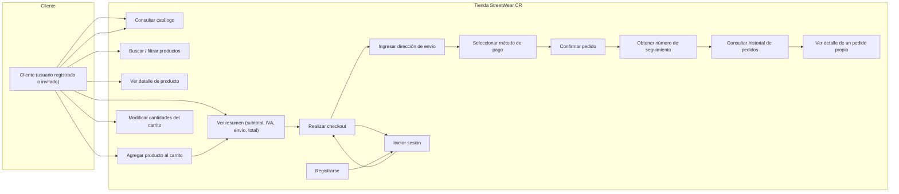

# Diagrama de Caso de Uso — Proceso de Compra (StreetWear CR)

Fuente editable (Mermaid). Puedes renderizarla en GitHub (vista previa),
mermaid.live o VSCode con la extensión de Mermaid.

## Diagrama

## Descripción breve del flujo

1. El cliente consulta el catálogo y puede **buscar o filtrar** productos
   por nombre, categoría y rango de precio.
2. Abre el **detalle** de un producto y lo **agrega al carrito**.
3. En el carrito **modifica cantidades** y revisa el **resumen** (subtotal,
   IVA 13 %, envío y total).
4. Para **realizar el checkout** debe estar autenticado (registrarse o
   iniciar sesión).
5. Ingresa la **dirección de envío** y selecciona el **método de pago**
   (tarjeta o PayPal, modo demostración).
6. Al **confirmar el pedido** se genera el **número de seguimiento** y el
   carrito queda vacío.
7. Desde su cuenta puede **consultar el historial** y **ver el detalle** de
   cada pedido propio (estado, productos, pago y seguimiento).

## Actores

| Actor | Descripción |
|---|---|
| **Cliente** | Cualquier persona que navega, compra y consulta sus pedidos. |
| **Sistema** | Ejecuta la compra, valida stock, genera tracking y registra el pago. |
| **Administrador** (relacionado, ver MANUAL.md) | Consulta y cambia estados de pedidos, consulta pagos y descarga reportes PDF. |
